## Run webpage

python3 -m http.server 8000

# Two spaces : NDC vs Screen

We can't work directly with pixels => because pixels depend on screen size/resolution => and if it works on 1920×1080, it breaks in 4K using pixels math

So we need a universal coordinate space :
- Normalized Device Coordinates (NDC)
- "Device Coordinates" = coordinates relative to the screen system => no more compatibility issue

What is it ?

it's a fake screen => and every screen (whatever the size), temporarly becomes this fake NDC screen defined as : 

- x ∈ [-1, +1]
- y ∈ [-1, +1]
- center = (0,0)
 

So now we can do math in this universal screen, and then convert it to be correct on the screen in use. Our math will never be wrong whatever the screen because : 

1. we do it in the universal coordinate system
2. we translate the result to the final screen width and height

Conclusion : NDC does not care about absolute pixels => only relative position to the center 

## NDC coordinate to Screen coordinate

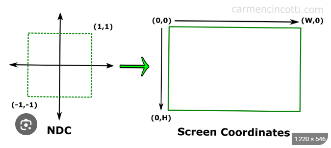

how to go from x ∈ [-1,+1] to x' ∈ [0,w] ?
- x' = (x+1)*(w/2)
- y' = (y+1)*(h/2)

## point({x,y})

- need to put a square/vertex with center x,y. 
- but fillrect takes upper left corner, so let's give it (x-size/2, y-size/2)

# 3D to 2D : Projection

3D point : (x,y,z) = where is the point relative to the eye/camera 

first let our eye/camera be at (0,0,0)

so this makes :

x = left/right from camera center
y = up/down from camera center
z = forward distance from camera

what is the screen ?
- it's a flat plane at some +z distance from the camera 

Now how does it all work out ?

- take a point : P = (x, y, z)
- the point is assumed behind the screen
- the camera is assumed in front of the screen
- imagine a infinite line from camera to point (camera -> P)
- this line crosses the screen at a specific (x,y) = the 2D projection

Special case : z=0 

- then the point P is exactly on the plane where our eye is (maybe under or above our eye directly)
- But that the ray is not possible, it can't move (distance 0)

Normal case : 
- let the screen be at z=1
- then if your 3D point has z>0, it can be projected 
- #1 : z > 1 => then 3D point is behind the screen, by doing a ray from camera to P , you cross screen at (x,y)
- #2 : 0 < z < 1 => then 3D point is between camera & screen, but the ray is infinite, so it don't stop at Point , and continue toward screen to cross it at (x,y)

Insight : 
- camera is at x=0, y=0
- so if point is also at x=0, y=0 but z > 0
- it's projection to the screen will be exactly at x=0, y=0 as the ray is just horizontal line
- and thus the point projection is the same for any z, when x=0, y=0

## How to project 3D point onto 2D screen ?

1. Intuition/Idea :

- the farther something is (big z), the smaller it becomes 
- x' = x/z; y' = y/z

- again, image a plane with 4 points = vertices of a squarre
- if you look at it from close distance, vertices seem well spaced
- but more and more the plan gets back, closer the point gets visually => they tend towards a vanishing point = 0,0

2. Math : 
TODO

## Important : 
The projection's math works because we consider ourselve in a world where : 
- camera is at origin (0,0,0)
- "view direction" is positive z
- screen is mathematically defined as the plane z = 1

# Animation

- Animation = recompute positions over time + redraw repeatedly : 
- Loop = render loop

loop:
  update positions
  draw scene

- Frame t = image of your scene at a specific moment t

So showing many frames 1,2,... quickly makes your brain see motion, thus : 

- FPS = Frames Per Second = the frequency
- 60 FPS = smooth animation

So basically we need time, and thus are variable depends on time : x(t), y(t), z(t)

- setTimeout(fctRef, delay) : call the function right after the delay (in ms)
- so for 60 frames per second = 60 frames per 1000 ms = 1 frame per (1000/60)
- setTimeout(frame, 1000/FPS)

So like this we will just grow the offset of z (z=1 for screen) , with a variable dz, to move the point further from the screen

Ok but if at each frame we just do :
- dz += 1 => there is an issue 
- Indeed, you need to look at FPS
- if you have 30 FPS instead of 60 FPS, then you have less frame per seconds, and thus dz will become 30 in 1 sec, while the other will get 60 in 1 sec
- but this is not okay, having more FPS should not make the animation go more far, it should just make it more smooth/less skewed

So that means we need to have : 
- for whatever FPS x we have, we should always in 1 second get a fixed increase dz, for example in 1 second, dz should increase of 1
- To achieve this, we need to look at how many frames we have in 1 second = FPS
- and we need each frame to increase dz by only a fraction of 1 so that the sum after all frames makes 1 
- so : dz += 1*dt where dt = 1/FPS = the fraction of 1 this frame will contribute . If this happens for each frame we get : 
FPS * 1/FPS = 1 sec.

Now it's normalised, whatever your fps, you will always in 1 second , achieve the same distance z. But still, more FPS = more draw = more motion = more smooth

## Insight 
the further the point is (big z), the closer the x and y tend to 0. This is called vanishing point and it's logical from the formula as we divide by z. But also intuitively : 

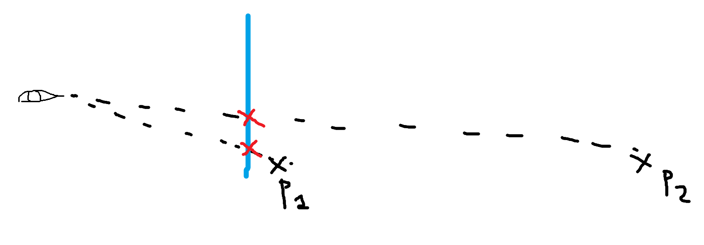

# Translation

= moving a point in space : 
- translation of x => point will move left/right
- translation of y => point will move up/down
- translation of z => point will move forward/backward

translation(x,y,z) : (x + tx, y + ty, z + tz)

For animation, we change only z => so we do a "z-translation" : translation_z(x,y,z) : (x, y, z + tz) => this translation control how big things appear
- why ? because x/z and y/z will make the points of a shape tend toward the center, thus scaling it down. 

## Depth is non-linear

- if you start with all your points at z : 0.8 and you play the animation. They seem to move fast toward center
- but if you start with them all at z : 10, they move slow toward center

- actually, as we know, whatever the z is, it will always increase of 1 every second, so they move the same speed

What actually happens is that : 

- in 1 second, z moves from 0.8 to 1.8. This makes a big difference in x' = x/z between the two frames
- but when z moves from 10 to 11, the difference between the x' is not that big, so visually the point didn't moved much

- ex : z = 2->3 : 2/2 = 1 vs 2/3 = 0.666 => difference is bigger (0.333)
- ex : z = 10->11 : 2/10 = 0.2 vs 2/11 = 0.1818.. => difference is smaller (0.18)

Formally :

- projection is : x' = x / z
- change of point between frame is : Δx' = x/(z + 1) - x/z
- so if z small => denominator change matter a lot
- if z is big => denominator barely change result  

# Recap #1 :

1. 3D world space : 
- (x, y, z)
- final goal : project into canvas = screen

2. 3D to 2D :
- 2D = NDC space
- done with x/z, y/z
- it's a projection at the plane z=1 which is our NDC screen

3. NDC space to Screen space :
- NDC = special coordinate system = only relativness , no pixels
- but to see on a certain device, you need a canvas, you need pixels coordinate
- so we use NdcToScreen({ x, y })

4. Understanding our pov :
- we (our eyes/pov in canvas), is at (0,0,0) => so z = 0
- so if we a point at z > 0, it's in front of us => we will see it
- if z < 0, behind us => we see it's projection but mirrored/inverted 

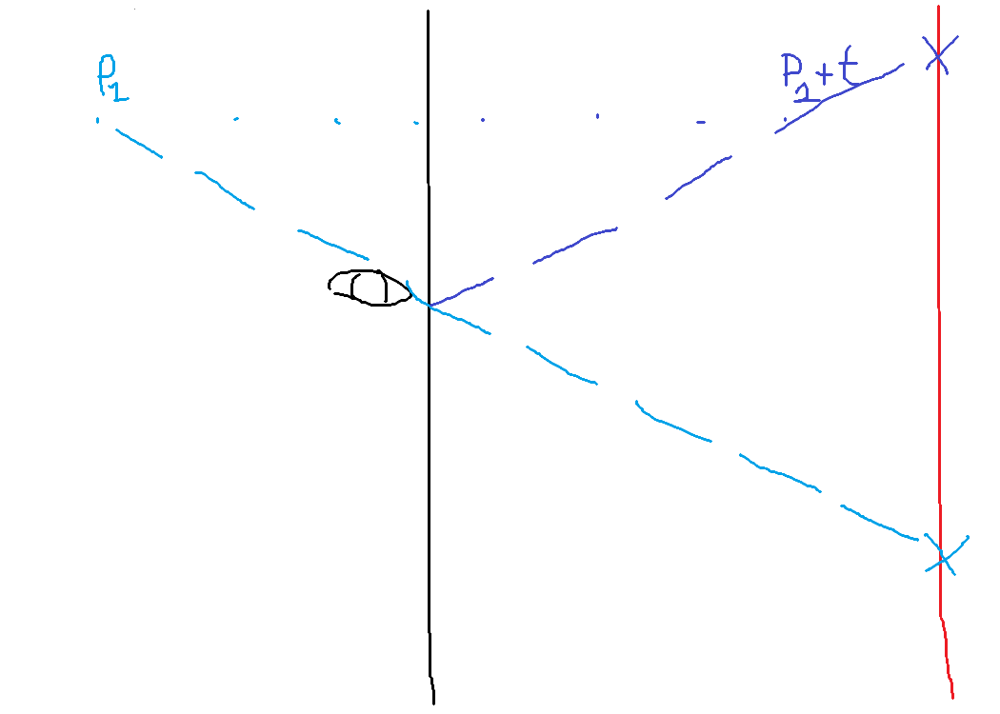

Also rule of thumb :
- if x/z or y/z bigger than the range they have [-1,1] => then out of frame/canvas => can't see it
- being able to see has nothing to do on z being + or - and everything to do on the ration x/z, y/z => so is x,y > z => then can't see 

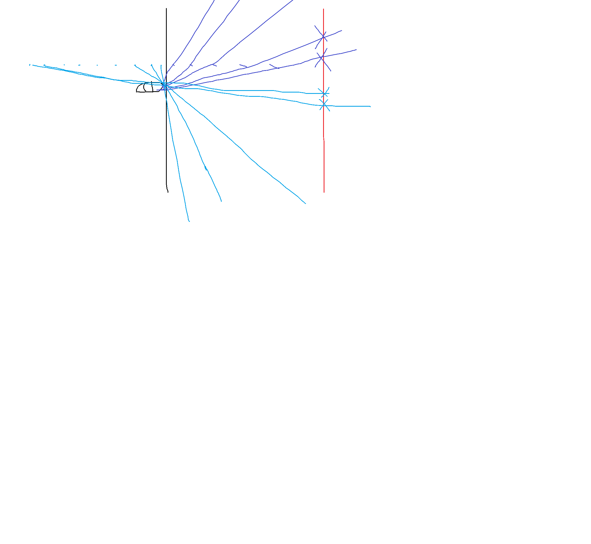

the complete idea of point 4 is : 

- point is behind our eyes but far enough behind => then we can see it's projection but mirrored
- point is behind but too close to our eye's plain => then we can't see it in the screen
- point is in front of the eye's plan but too close => we can't see it in the screen
- point is in front but far enough but still before the screen => we can see it , (we will just see it scaled up)
- point is behind the screen (and of course in front of the eye's) => it will get smaller and smaller the farther behind the screen => so tend to vanishing point

And so now it makes sense that putting dz = 1, means for example instead of starting with one square at -0.5 and the other at 0.5, 
we start with one squarre at 0.5 and the other at 1.5 which means we directly see all the cube as 0.5 is sufficient distance because 0.5/0.5 = 1 so in range for x,y
and it will always increase so the 0.5 and 1 will become bigger and bigger and the ratio x/z and y/z will become smaller and smaller => 3D cube scaled down and visible

my conclusion for now is : 
- we can scale an object by translation along z axis

# Rotate 

rotation = turns the point around a center

- Take the 2D point (1,0) = (right,center)
- rotate it 90° => (0,1) = (center, bottom)

The important thing with rotate is : distance from the center stay the same

## From 2D rotation to 3D rotation

To rotate in 3D, we just need to understand 2D rotation

Why ?
- because every 3D rotation happens inside a plane.
- eg : rotate in XY plane → z stays constant

- or in another way : rotation is around axis z => z stay constant, only rotate (x,y)

Distance to the center stay the same => so what defines the rotation ?
- the angle θ : define the segment from center where it's extremity is exactly where the new point should be
- distance to the center

So if distance stay the same, but angle change => this is by definition moving around a circle : 
- Rotation = moving along a circle

Now image distance to center = 1 , this is the unit circle : 
- x^2 + y^2 = 1
- in this circle any points (x,y) = (cos θ, sin θ)

proof : 
- SOH CAH TOA
- Sin = Opposite / Hypotenuse => sin θ = opposite/1 = opposite = y
- Cos = Adjacent / Hypotenuse => cos θ = adjacent/1 = adjacent = x

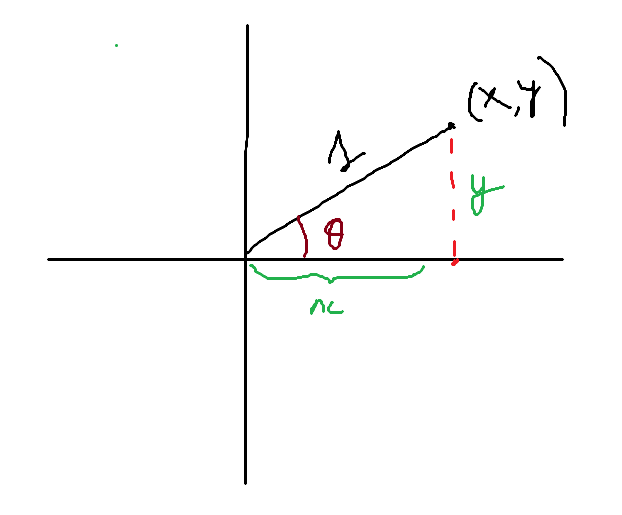

Ok so we know that in this unit circle : (x,y) = (cos θ, sin θ)

Ok so imagine our point at : (x, y) = (cos α, sin α)
We want to rotate it => of what ? => an angle θ 
So the angle of (x', y') should be α+θ => (x', y') = (cos(α + θ), sin(α + θ))

Nice we have solved rotation ... well no => there is an issue : 
- we only know x, y and that we want to rotate of θ
- so what is missing ? => well the initial α of (x,y) is unknown

We can thus trigonometric identities : 
cos(α+θ) = cos(α) * cos(θ) − sin(α) * sin(θ)
sin(α+θ) = sin(α) * cos(θ) + cos(α) * sin(θ)

we can substitute x and y as => x = cos(α) & y = sin(α)

x' = cos(α+θ) = x * cos(θ) - y * sin(θ)
y' = sin(α+θ) = x * sin(θ) + y * cos(θ)

this is the final formula on rotation

Ok but wait : 
- x = cos(θ) & y = sin(θ) is only valid for unit circle
- for a general point P, distance to center != 1

- ok so actually it's okay because everywhere there is always the radius r but we don't see it because it's 1

unit circle = direction only (magnitude=1)
real point = direction × magnitude

It just becomes :
- x = r cos(α)
- y = r sin(α)

- all points in the rotation have same radius so r'=r
- x' = r cos(α + θ) 
- y' = r sin(α + θ)

- x' = r (cosα cosθ − sinα sinθ) => x' = r cosα cosθ − r sinα sinθ => x' = (r cos(α)) cosθ − (r sin(α)) sinθ => x' = x cosθ − y sinθ

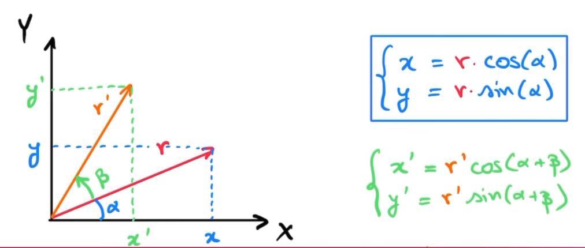

Formula unchanged : 

x' = x * cos(θ) - y * sin(θ)
y' = x * sin(θ) + y * cos(θ)

# Pipeline 

MODEL SPACE (your vertices) = 3D
        ↓
translation / rotation (still in 3D) -> here you move your object where u want in space
        ↓
projection (x/z, y/z) = 2D
        ↓
NDC (-1 to 1) = strict range
        ↓
screen (pixels) = [0, width] & [0, height]

# Vertices & Faces
We already have a sort of simplest possible 3D engine because if you give me a shape (even complex) by giving : 
- all it's vertices
- how should they be connected (so the faces)

Then i can draw those vertices & edges
And each point can be independenly (all together of course) rotated/translated

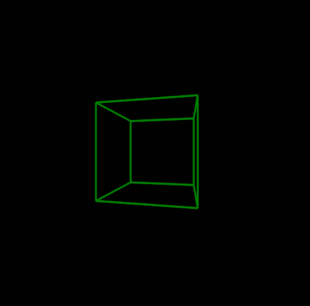
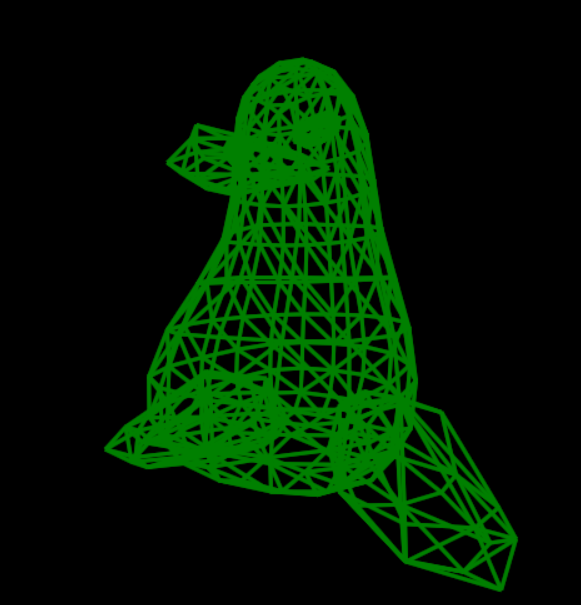

# Camera & Models

I have remarqued that the model (files with vertices), have generally z values for each vertex that are close to 0 from + & - (eg : our cube has z = -0.25 or +0.25)

Well it's because when model are designed, they are done around a center (0,0,0) (so in a cube, this is literally the center of the cube in 3D)

But in our system : 
- Camera = (0, 0, 0)
- Looking toward +z direction
- So, will not see anything in negative of z

Example with image of penguin if i only take the original model, here is the camera pov : 

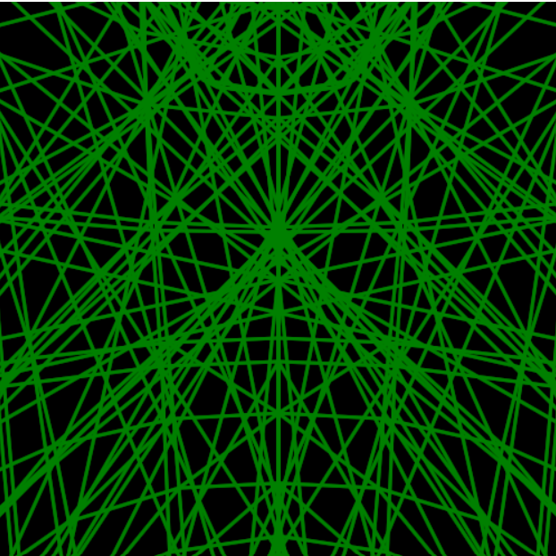

So how do we use these model ? 
- well it's simple => just move the model forward so it's all in the positive z
- how ? => use translation_z (x,y,z) : return (x,y,z+dz)
- for example here is the same model but with translation as dz=1 :

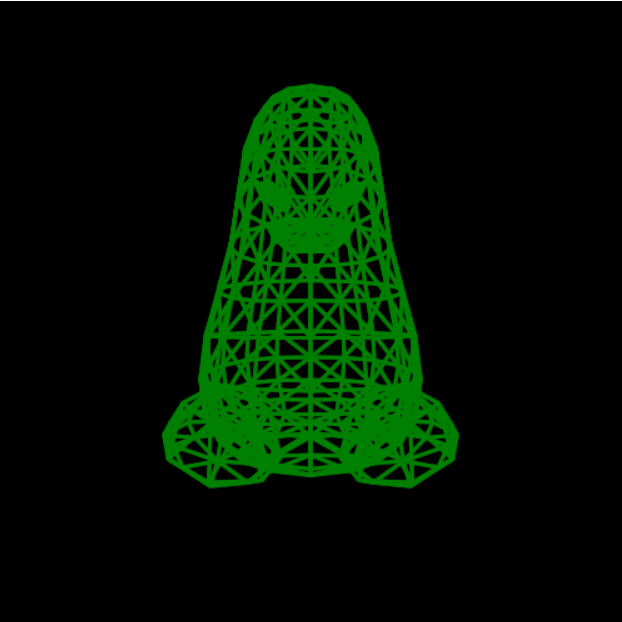

# Transform(p)

So i just added this function as a way to initiate our model and do any kind of operation in it to place it where we want, and animate it how we want :

- Statically place it somewhere => use translation
- Statically rotate it => use rotate

- Animated translation/rotate = same thing as static but in a loop where dz/angle change

# Order of operations matter !

1. Rotate
- important thing to understand is that rotate final formula only work on the assumtion that we rotate around (0,0,0)
- that means each time you use rotate in the code, you will be rotating you object around (0,0,0)

So what happens between these 2 :

translate_z -> rotate :
- 1. first we move the object farther => so you see a 3D cube in front
- 2. then we rotate but around (0,0,0) like always => you will see the 3D cube when rotation is on the +z, but it will dissapear when rotation is behind camera ;as it rotate around (0,0,0)

rotate -> translate_z :
- 1. your object is initially centered around (0,0,0) like all models
- 2. you make it rotate => so visually you only see face come and go in front of you (because you are inside the cube + it rotates around camera)
- 3. then you translate_z => rotated cube shifts forward => center becomes (0,0,dz) 
- So this is the order that makes the cube "rotate in place" at a certain center (0,0,dz)

# Time for a class 
I'm now to the point i have many shape being rendered at once : 
- 9 for all canvas preview in selection menu
- 1 in the background that change dynamically based on what is clicked and is displayed then

But all the functions i have use some global var "Canvas" & "CurrentModel"
It's hard to pass params to each function to give the right vars, so better is to understand now is the time for classes , because :  

each shape is rendered in it's own universe with it's own : 
- canvas
- 2D context
- model

# Camera
So first my initial intuition :

- we are not really "moving" in this space, but we just want to make us feel like we are moving. 
- for example if i press right -> i want to see the shape from the right side, making me see less of it's less side and more of it's right side, but also making the shape not anymore centered

So the idea is that we want to simulate this through transformation on the shape, namely : translation and rotation

for example here, when clicking on right arrow to move camera right we actually do :
- translate shape left of this amount

And for rotation, my intuition :

- basically there is 3 ways of rotating , rotatating on the circle that is in the plane XY, XZ, YZ
- but for a specific plane, you just have a circle right
- and what do we know about circle 
- well we know that to get a point on it it's just : cos(angle), sin(angle)

okay so now if camera rotates right (yaw +θ) -> it just means we should rotate the world left (-θ)
same idea for the other axes/plane

So in general if : 
- camera has "fake" position C , "fake" rotation R

1. translate world : 
- P1 = P - C

2. rotate world opposite camera rotation

## Camera Translation 
- up/down
- right/left
- front/back

How ?
- just do oppositive of camera movement for every vertex : 
- p = translate(p, -camera.x, -camera.y, -camera.z) to make the camera "move"

## Camera Rotation 
- yaw (left/right)
- pitch (up/down)
- roll (tilt)

How ?
- just use -angle in the rotate to basically make the object rotate in the opposite way making you fill like you do camera rotation

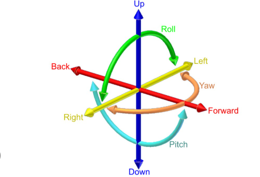
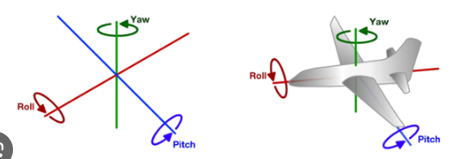

## But this is not enough :
- right now if we turn our "head" right, then move forward, we move forward in the globally defined z axis and not in the direction where camera is facing
- it's not like FPS pov right now

A camera has 2 things :
- a position <x,y,z>
- a direction where it's looking

When camera rotates, 3 vectors are changed : 
- Right vector → where "right" is → sideways direction
- Up vector → where "up" is → vertical direction
- Forward vector → where "forward" is → direction it looks

Let's first focus only on Yaw = turning your head left/right 

Assume Y-axis is the "up" vector, that means here we rotate around Y. 
We thus have this plane XZ : 

        Z+
        ^
        |
X- <--- + ---> X+
        |
        v
        Z-

When yaw = 0 => it means u are looking in forward => so vector for forward is logically : forward = (0, 0, 1)
You can already see that in this position :
- moving forward will mean doing +Z
- moving right will mean doing +X
- moving left => -X
- moving backward => -Z

Ok but what happens after we rotate the forward vector around Y ?

Rotation around Y axis:
x' = x cos(yaw) + z sin(yaw)
z' = -x sin(yaw) + z cos(yaw)

So on our current forward vector (0,0,1) : 
x' = x * cos + 1 * sin = sin(yaw)
z = -0 * sin + 1 * cos = cos(yaw)

after rotation : forward = (sin(yaw), 0, cos(yaw)) => this is the general formula to re-compute forward direction when camera rotation happen

Ok now what about when we want to move right ?

- well we can use our precedent work, as moving right is just moving along the vector that is forward vector rotated by 90°
- and in math we know that when u have a vector (x,z) and rotate it by 90° right, it becomes (z,-x), proof under : 

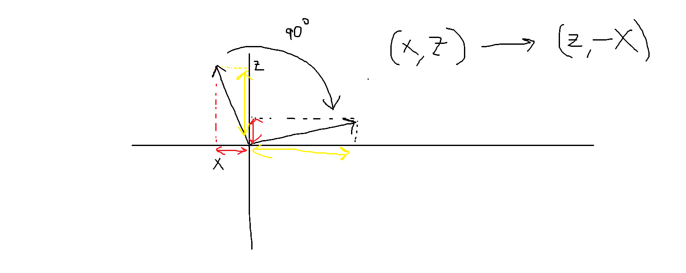

So in our case forward vector is always : (sin(yaw), 0, cos(yaw))
right vector is always : (cos(yaw), 0, -sin(yaw))

So finally we have these camera movement rules : 

Forward / Backward:
- pos += forward * speed
- pos -= forward * speed (opposite direction)

Right / Left:
pos += right * speed
pos -= right * speed (opposite direction)
